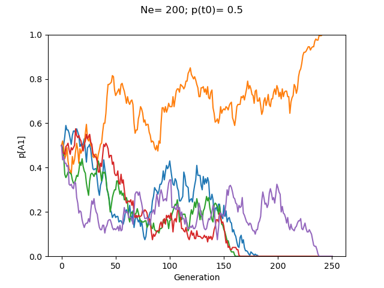
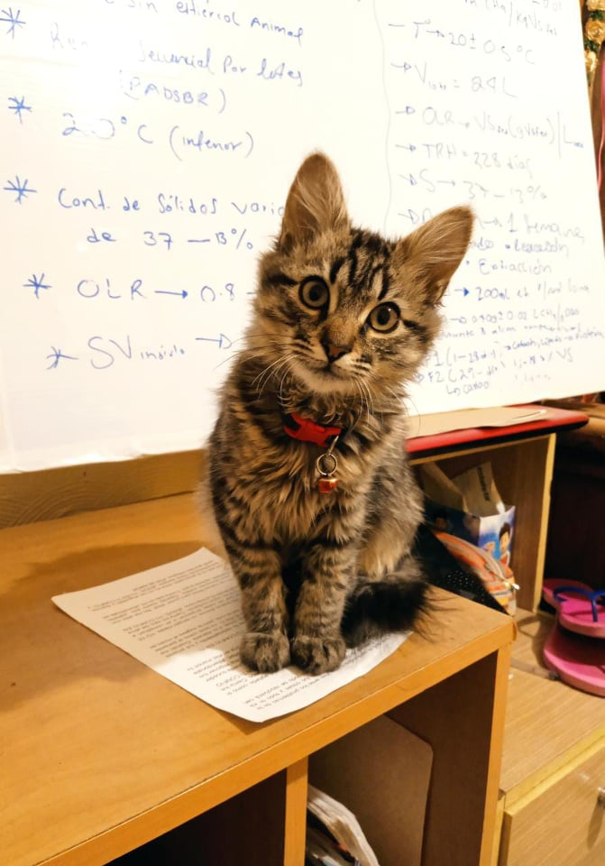

## SimuDrift
By: Luis Rodrigo Arce-Valdés (01-30-22)

### Introduction
SimuDrift.py is a simple genetic drift simulator python 3 script. This program creates plots of simulations of changes in allelic frequencies across generations as a function of initial effective population size and initial allelic frequencies. The program assumes a Fisher-Wright-like closed population of haploid organisms with non-overlapping generations, mutations or natural selection.




### Modules
Before attempting to run this script you need to have installed on your computer Python3, and the `numpy` and `matplotlib` modules.
Follow [this tutorial](https://docs.python.org/3/installing/index.html) to learn how to install python modules. Personally, I prefer to use `conda` as environmental manager insted of installing using `pip`. If you wish to install using conda, [here](https://docs.conda.io/en/latest/miniconda.html) is the documentation of Miniconda: thre free minimal installer of conda. After installing it. You can use conda to install the required modules using:

```
conda install -c anaconda numpy
conda install -c conda-forge matplotlib

```

### Instalation
Simply download the `SimuDrift.py` script and run it via a Unix terminal using:

```
python SimuDrift.py

```

For Windows users I found [this tutorial](https://www.youtube.com/watch?v=Qi28uPKaH_A) explaining how to use Python.


### Usage
After running the script, the program will automatically ask the user for the input of the following parameters:
1. **Number of A1 alleles in the population**. These are the alleles that the program track their relative frequency.
2. **Number of A2 alleles in the population**. The frequency of this other alleles are easily estimated as: q = 1 - p.
3. **Number of generations**. For how many generations will the program run?
4. **Number of simulations**. How many simulations will the program do?

All of these parameters **must** be inputed as an integer higher than 0 for the program to run!

### Enjoy


